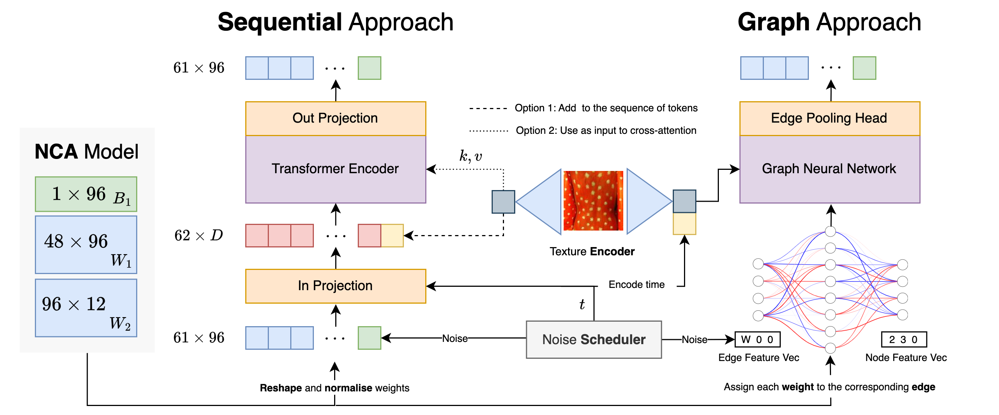

# Conditional Weight-Space Diffusion for Neural Cellular Automata in Texture Synthesis




Realistic texture synthesis plays a vital role in numerous downstream applications, ranging from gaming to virtual reality. Among the various approaches, Neural Cellular Automata (NCA)-based methods represent the current state-of-the-art. However, despite their many advantages, these methods require per-instance training, which hinders their scalability and limits their use in real-time settings. To overcome this limitation, we propose a **conditional weight initializer** that accelerates the adaptation of NCA models to novel textures at test time. Specifically, we leverage a conditional diffusion model that maps a texture image directly to the corresponding NCA weights, which can then be optionally fine-tuned to further improve synthesis quality. Our results demonstrate that this approach can significantly reduce convergence time while maintaining high-quality synthesis performance, thus enabling faster and more scalable texture generation.


## Installation

Assuming you have access to EPFL's Izar Slurm cluster, start with creating a venv in your home directory (and activate it):

```bash
module load gcc python
virtualenv --system-site-packages venvs/hypernca
source venvs/hypernca/bin/activate
```


Then downgrade the setup-tools version:

```bash
pip install setuptools==65.5.0 --upgrade
```

Finally, install the packages:

```bash
pip install --no-cache-dir -r requirements.txt
```


## Download data

Since we are not owners of the data, please write to `ludek.cizinsky@epfl.ch` to get access to the data. We will provide you with a link to the data which you can the input in the `download_data.py` script.

For downloading data run:
```bash
python download_data.py --dest_path <your_path>
```

## Running Experiments

### NCA Training
For running NCA training run the following command
```bash
python train_nca.py model.use_diffusion_sampled_weights=False model.use_bubbly_weights=True
```
Please change the run command or the config ```configs/train_nca``` accordingly for reproducing a specific experiment.

### Training Diffusion Models
For training diffusion models simply run the following commands.
```bash
python train.py model.type='baseline' model.use_cross_attention=False texture_encoder='gram'
```
for reproducing the baseline model. Please modify the config accordingly for reproducing any of the other experiments.


### Evaluation of Models
For evaluating any of the sequentual conditional models simply run ```cond_model_sample.py```. For evaluating the graph meta networks run ```gnn_eval.py```.

## Project Structure

```txt
.
├── README.md
├── assets # Some saved plots and figures
│   └── unconditional
│       ├── fid_training_epochs.png
│       ├── kid_mean_training_epochs.png
│       ├── lpips_training_epochs.png
│       ├── psnr_training_epochs.png
│       ├── samples
│       └── time_samples
├── cond_model_sample.py # Script used for evaluating conditional diffusion models
├── configs # Configs
│   ├── conditional_clip.yaml
│   ├── conditional_clip_cross_attn.yaml
│   ├── conditional_gram_baseline.yaml
│   ├── conditional_gram_cross_attn.yaml
│   ├── conditional_vit.yaml
│   ├── conditional_vit_cross_attn.yaml
│   ├── texture_encoder
│   │   ├── clip.yaml
│   │   ├── gram.yaml
│   │   └── vit.yaml
│   ├── train.yaml
│   └── train_nca.yaml
├── download_data.py # Script for downloading data
├── helpers
│   ├── __init__.py
│   ├── callbacks.py # Lightning callbacks
│   ├── dataset.py # build torch dataset and prepare dataloaders
│   ├── diffusion.py # diffusion logic
│   ├── evaluator.py # class for computing metrics like FID, LPIPS, PSNR etc.
│   ├── generator.py # Class for generating NCA textures based on weights
│   ├── graph_denoiser.py # Graph denoiser model
│   ├── model.py # Sequential transformer model
│   ├── nca # Code for NCA model
│   │   ├── __init__.py
│   │   ├── nca_data.py # nca torch dataset and dataloader
│   │   ├── nca_loss.py # nca loss (texture loss)
│   │   ├── nca_model.py # nca model
│   │   ├── nca_pl_module.py # nca lightning module
│   │   └── utils.py # utils like transforming weight matrix to separate NCA weights W1,B1,W2
│   ├── optimizer.py #
│   ├── pl_module.py # Cosine scheduler implementation
│   ├── texture_encoding.py # ViT, Clip and Gram texture encoders
│   ├── tokenisation.py # functions for reshaping tokenized weights
│   └── utils.py # utils like transforming weight matrix to separate NCA weights W1,B1,W2
├── notebooks
│   └── post_train_eval.ipynb # notebook for evaluating conditional diffusion models after training
│   └── graph_meta_bets.ipynb # notebook used for investigating the graph meta networks
├── requirements.txt # requirements for this project
├── results_stored 
│   ├── cond_diff_results.json # conditional diffusion results stored in json
│   └── h1_df_real.json # results related to H1 stored in json
├── sample.py # script for generating textures for trained NCA model
├── subset_data.json # a subset of the NCA dataset used for training NCA models in train_nca.py
├── gnn_eval.py # post training evaluation of graph meta networks
├── gnn_eval.slurm # slurm job script
├── train.py # script for training sequential diffusion models 
├── train.slurm # slurm job script
├── train_nca.py # script used for training NCA models 
├── train_nca.slurm # slurm job script
└── viz_results
    ├── h1.py #
    ├── h1_generate_images.py # create visualization for h1
    ├── h1_generate_images_with_time.py # create visualization for h1 over time (epoch)
    ├── h1_plot.py # create plot of metrics FID, LPIPS etc as function of epochs
    ├── q1.py # create tables for results for condtional diffusion model
    └── show_unconditional_images.py # script used for stichting conditional qualitative samples together

```

## Acknowledgements

We would like to thank to [Ehsan Pajouheshgar](https://pajouheshgar.github.io/) for providing the data and the [nca code](helpers/nca/) which we slightly modified. In addition, we have adopted Ehsan's EDM scheduler and Gram encoder code. Further, the graph [construction code](helpers/gmn/) is taken from [graph meta nets repo](https://github.com/cptq/graph_metanetworks/tree/main/gmn). We have modified it so that also the global feature vector can be used.
